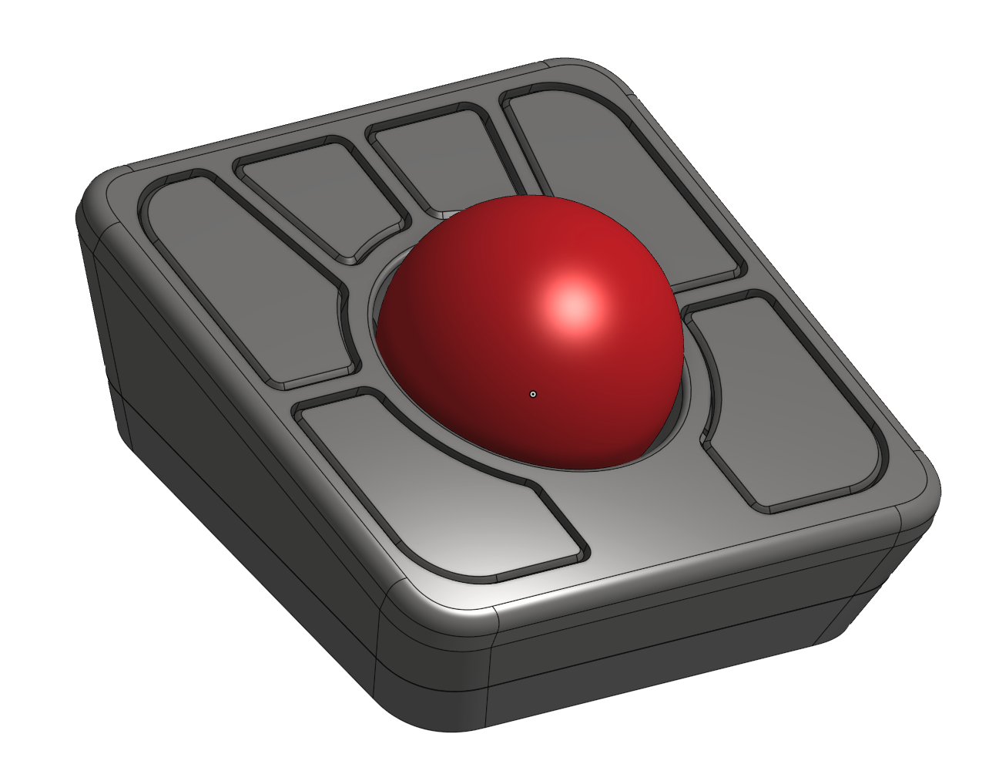

## Adept + 44-45mm ball

> ✅ [ISO-2025EFOG](https://github.com/efogdev/ISO-2025EFOG) compliant

Q: Layer height? \
A: 0.2 mm

Q: What is the standard mod? \
A: It is the original case modified top fit the BTUs. All you need is to reprint the top part. For more info, see [here](./standard/README.md).

Q: What is the short mod? \
A: It is a slightly smaller mod, where both the top and the bottom of the case are changed. The blank space at the end of the top of the original case is remove, and the bottom part is aligned with the top (in the original it is smaller). \
For more info, see [here](./short/README.md). \
This is how it looks: \

