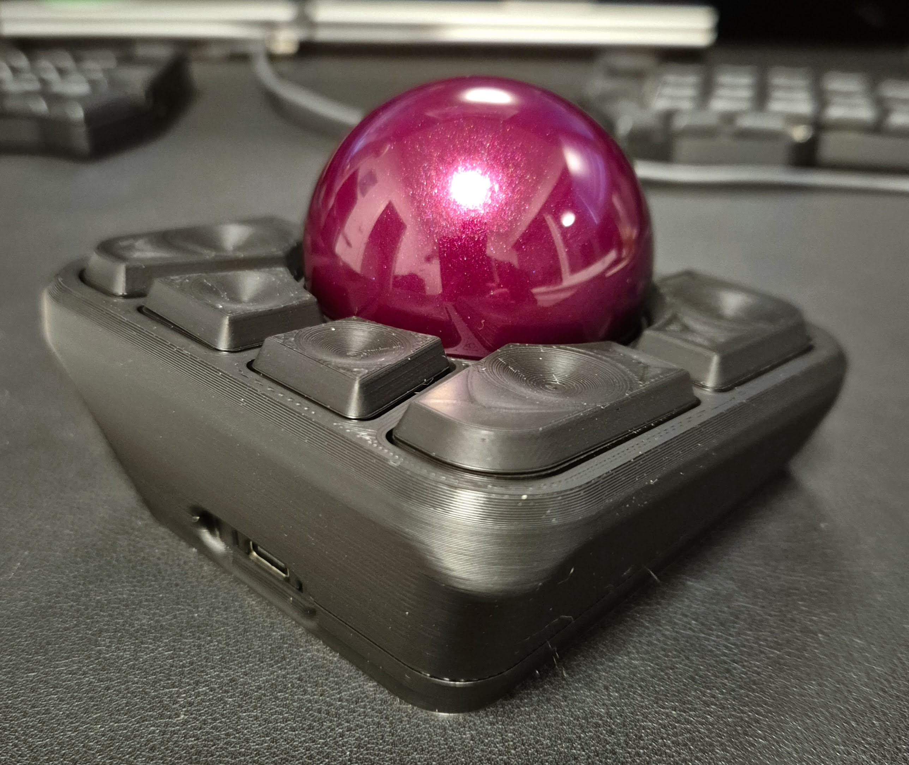

# Adept 55mm ball

  
  
  

> ✅ [ISO-2025EFOG](https://github.com/efogdev/ISO-2025EFOG) compliant

This mod is an adaptation of the original case where the top and bottom of the original adept are changed. The optics cover (bottom of the top case) is the same as the original.
The mod is designed for a 55mm ball, but might support other balls too (not tested!).

The following files are available in both STEP and STL:

- top-short-55mm: the top of the case without magnet holes
- top-short-55mm-magnets: the top of the case with magnet holes
- bottom-short: the bottom of the case. The bottom of the short mod is the same for the 55mm and 45mm, it is just available here too for convenience
- logo-insert-short: insert for the logo. It can be printed in different colors, if desired
