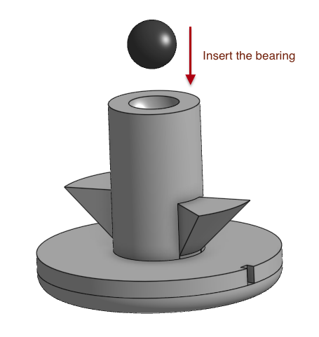
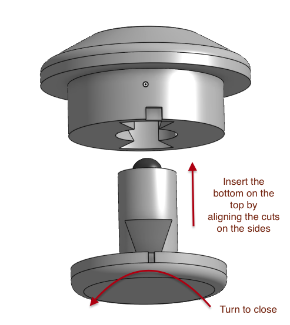

## Adapters

This folder contains various adapters. \
Most work best with TPU, but PETG and PLA are also fine.

### Veichu

Allows Veichu 7.5mm BTUs to be used instead of Rexroth ones. \
Not recommended for >50mm balls. \
[Github issue](https://github.com/adept-anyball/mod/issues/4)

### Static

[Github issue](https://github.com/adept-anyball/mod/issues/8)

#### 3-3.5mm

Allows static bearings of size 3-3.5mm to be installed. \
Not recommended for heavy balls.

#### 2.5mm, 3mm and 3.5mm (no glue - 2 pieces)

Allows static bearings of 2.5mm, 3mm or 3.5mm to be installed (choose the correct file according to the size of the bearing)

> This adapted consists of 2 parts, so make sure to split it in your slicer. \
> This adapter requires no supports to be printed. \
> The 3mf for the 2.5mm is included too, if you have a Bambu Labs printer. It is recommended to print with a layer height of .1mm and width of .3mm, since the parts are small.

> **DISCLAIMER: Since I don't have any 3mm or 3.5mm static bearing at hand, then these 2 models are untested for the time being.**

To use it, insert the bearing ball in the bottom of the adapter. Slide the bottom part in the top part and turn the bottom to lock.

  
  

### MR63 ball bearings

Allows default Ploopy MR63 ball bearings to be installed. \
[Github issue](https://github.com/adept-anyball/mod/issues/22)

## Notes

Please print adapters oriented like this:

