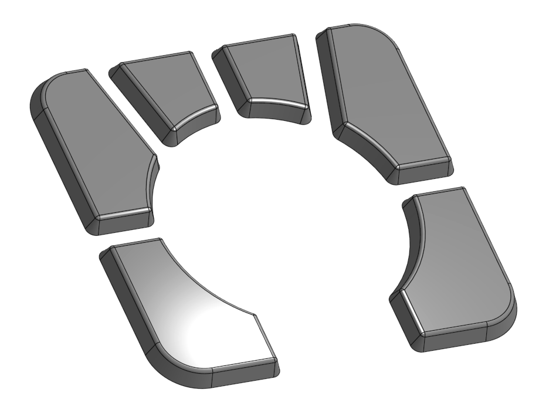

# Buttons

The buttons in this folder are [ISO-2025EFOG](https://github.com/efogdev/ISO-2025EFOG) compliant and are compatible with the mods that follow the standard. The shape and size are absolutely identical to the default Ploopy buttons.

## Spherical 5mm

5 mm tall with a 2 mm deep spherical cut:

## Flat 5mm

5 mm tall flat buttons

## Default

The default style buttons will look like this:

